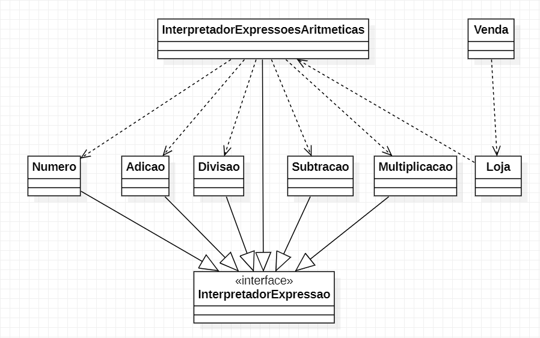

# Interpreter

No padrao Interpreter é somente para fazer mudança na classe Aluno, e classe Escola, do nosso "jeito".  
O restante das classes não é para fazer alterações.

**Caso de uso:** Desconto de um produto em uma loja.  
Poderia também ser aplicada alguma taxa em um produto, soma de múltiplos produtos, etc.

Diagrama:  
